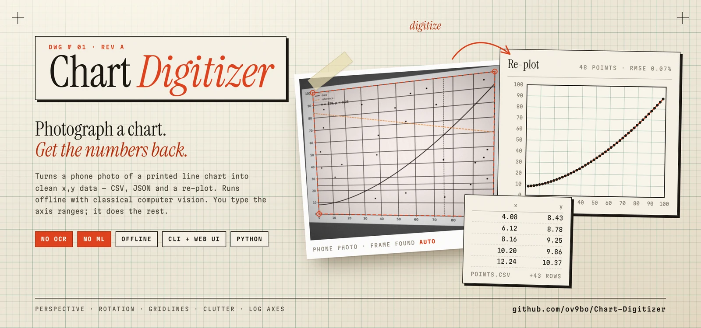
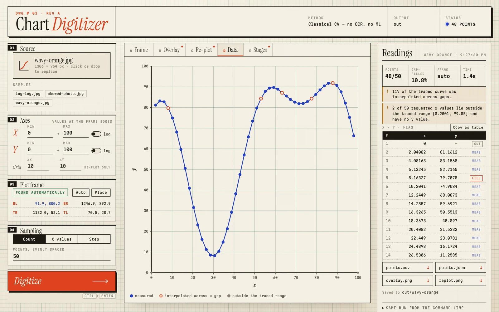
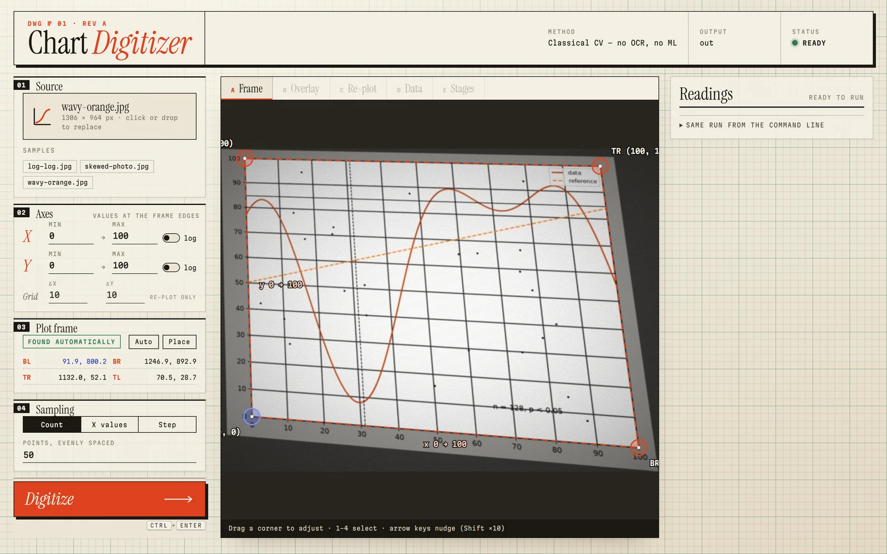
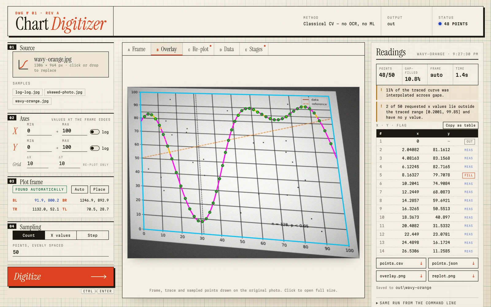
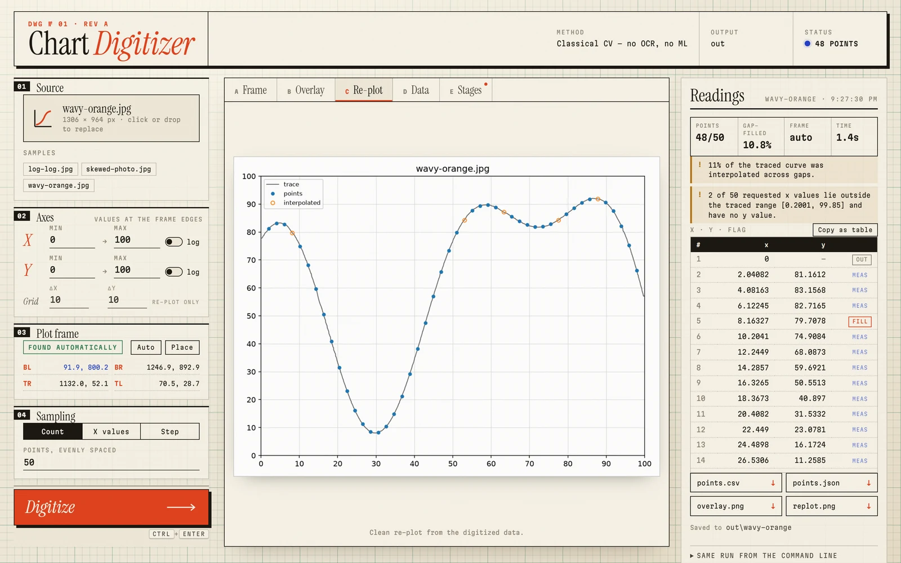
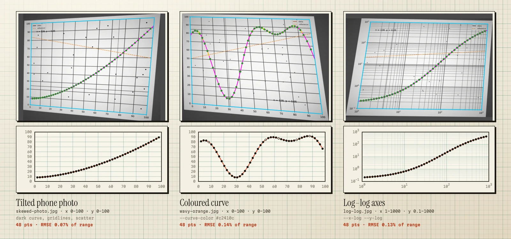
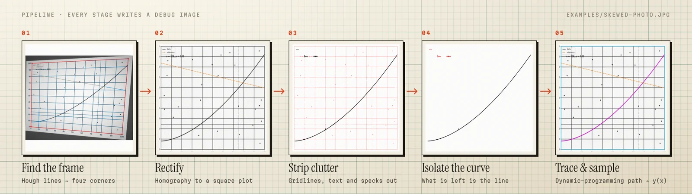

<!-- Chart Digitizer: extract data points from a photo of a line chart, offline, with classical computer vision. -->

<p align="center">
  <a href="https://ov9bo.github.io/Chart-Digitizer/">
    
  </a>
</p>

<h3 align="center">Photograph a chart. Get the numbers back.</h3>

<p align="center">
  An offline <b>plot digitizer</b> for photos and screenshots of 2D line charts.<br>
  Finds the plot, undoes the perspective, strips the gridlines and text, traces the curve,<br>
  and writes <code>points.csv</code>, <code>points.json</code> and a clean re-plot. No OCR. No ML. No cloud.
</p>

<p align="center">
  <a href="https://github.com/ov9bo/Chart-Digitizer/actions/workflows/ci.yml"></a>
  
  <a href="LICENSE"></a>
  
  
</p>

<p align="center">
  <a href="#quick-start"><b>Quick start</b></a> ·
  <a href="#the-web-app">Web app</a> ·
  <a href="#command-line">Command line</a> ·
  <a href="#how-it-works">How it works</a> ·
  <a href="#accuracy">Accuracy</a> ·
  <a href="#faq">FAQ</a>
</p>

<br>

You have a curve on paper (a pump curve in a datasheet, a figure in an old paper, a chart on a
whiteboard) and you need the numbers behind it. Chart Digitizer takes a phone photo of it, tilted,
unevenly lit, covered in gridlines and annotations, and gives you back the data as `x, y` pairs.
You tell it the axis ranges; it does the rest.

It is built only on **classical computer vision** (OpenCV, NumPy, SciPy): Hough lines, a
homography, morphology and a dynamic-programming tracer. There are no neural networks, no OCR and
no network calls, so it runs the same on an air-gapped laptop as anywhere else, and every step can
be inspected.

## Highlights

- **Works on photos, not just clean exports.** Perspective, rotation, glare, shading, blur and JPEG
  noise are corrected or tolerated. The plot frame is found automatically.
- **Ignores the clutter.** Gridlines, axes, reference lines, scatter points, legends and text are
  removed before tracing. Where the curve crosses them, it is kept.
- **Follows the right curve.** By default it takes the dominant dark curve; give `--curve-color`
  to pick one coloured curve out of several.
- **Linear and log axes**, on either or both axes.
- **Honest output.** Every point is flagged as measured, gap-filled or out of range. It never
  extrapolates, and it never fails silently: errors name the stage that gave up and what to try
  next.
- **A web app and a CLI.** Drag a photo into the browser, nudge the corners with a loupe, and read
  the numbers; or batch a folder of charts from the command line.
- **Everything is a file.** Settings are YAML (with a typo check), results are CSV, JSON and PNG,
  and `--debug` writes an image from every stage.

## Quick start

You need Python 3.11+ and [uv](https://docs.astral.sh/uv/).

```bash
git clone https://github.com/ov9bo/Chart-Digitizer.git
cd Chart-Digitizer
uv sync
```

Digitize the three bundled examples, each with its axis ranges in a YAML file beside it:

```bash
uv run digitize examples/
```

```text
[1/3] log-log.jpg: 48/50 points -> out\log-log
[2/3] skewed-photo.jpg: 48/50 points -> out\skewed-photo
[3/3] wavy-orange.jpg: 48/50 points -> out\wavy-orange
Done: 3 of 3 images digitized. Summary: out\summary.csv
```

Or your own photo. The ranges are the data values at the edges of the plot frame:

```bash
uv run digitize my-chart.jpg --x-range 0,100 --y-range 0,100
```

Open `out/my-chart/overlay.png` first: it draws the detected frame and the traced curve on your
photo, so you can see at a glance whether to trust `points.csv`.

## The web app

```bash
uv run digitize-ui
```

This starts a small local server at <http://127.0.0.1:8765> and opens it in your browser. Drop in a
photo (or click one of the samples), check the axis ranges, and press **Digitize**.

<p align="center">
  
</p>

<table>
  <tr>
    <td width="33%"></td>
    <td width="33%"></td>
    <td width="33%"></td>
  </tr>
  <tr>
    <td><b>Frame</b> · drag the corners, with a loupe at full resolution</td>
    <td><b>Overlay</b> · the trace on the original photo</td>
    <td><b>Re-plot</b> · the extracted points on clean axes</td>
  </tr>
</table>

- The plot corners are detected automatically and shown on the photo. Drag them, or press
  **Place** and click four corners, when detection misses.
- The **Data** tab links the chart and the table: hover a point to find its row. Copy everything
  as a table straight into a spreadsheet, or download `points.csv`, `points.json`, `overlay.png`
  and `replot.png`.
- **Stages** shows an image from every step of the pipeline, for when a result looks wrong.
- **Same run from the command line** gives the exact `digitize` command for the current settings.

The server only listens on `127.0.0.1`. It refuses requests whose `Host` or `Origin` is not the
local page, so other websites can't drive it. Run `uv run digitize-ui --help` for the port, output
folder and samples folder.

## Examples

The [`examples/`](examples) folder has three charts, each with its settings in a YAML file of the
same name. They are synthetic charts with simulated camera damage, so the true curve is known and
the error can be measured exactly.

<p align="center">
  
</p>

| Example | What it shows | Settings | Points | RMSE (% of range) |
| --- | --- | --- | --- | --- |
| [`skewed-photo.jpg`](examples/skewed-photo.jpg) | Tilted photo, uneven light, gridlines, scatter, a reference line | axis ranges only | 48 / 50 | 0.07% |
| [`wavy-orange.jpg`](examples/wavy-orange.jpg) | A coloured curve that rises and falls | `curve.color: "#c2410c"` | 48 / 50 | 0.14% |
| [`log-log.jpg`](examples/log-log.jpg) | Three decades on x, four on y | `x_log`, `y_log` | 48 / 50 | 0.13% |

The two missing points in each are the requested x values just past the ends of the visible
curve. They are reported as `out_of_range` rather than guessed.

## Command line

```bash
# The corners weren't found (or were found wrong): click them in a window with a magnifier
uv run digitize chart.jpg --x-range 0,100 --y-range 0,100 --interactive

# Give the corners in image pixels: (xmin,ymin) (xmax,ymin) (xmax,ymax) (xmin,ymax)
uv run digitize chart.jpg --x-range 0,100 --y-range 0,100 --corners 688,2758,3361,2728,3356,267,694,224

# Sample at specific x values, or every 5 units
uv run digitize chart.jpg --x-range 0,100 --y-range 0,100 --x-values 20,40,52,60,70,80,90
uv run digitize chart.jpg --x-range 0,100 --y-range 0,100 --step 5

# A red curve among others, on a log-log chart
uv run digitize chart.png --x-range 1,1000 --y-range 0.1,1000 --x-log --y-log --curve-color "#d62728"

# Every image in a folder, each with its own YAML next to it
uv run digitize charts/ --out results

# Write an image from every stage, to see where things went wrong
uv run digitize chart.jpg --x-range 0,100 --y-range 0,100 --debug
```

<details>
<summary><b>All options</b></summary>
<br>

`digitize IMAGE [OPTIONS]`. IMAGE is a chart image or a folder of them.

| Option | Meaning |
| --- | --- |
| `--x-range lo,hi` | Data values at the left and right edges of the plot area. **Required** (here or in YAML). |
| `--y-range lo,hi` | Data values at the bottom and top edges of the plot area. **Required.** |
| `--x-log` / `--y-log` | Logarithmic axis. The range must be positive. |
| `--points N` | N evenly spaced points (the default, with N = 50). Evenly spaced in log10 on a log x axis. |
| `--x-values a,b,c` | Exactly these x values. |
| `--step S` | A point every S data units along x, from the lower x limit. |
| `--corners x1,y1,...,x4,y4` | Plot corners in source-image pixels, ordered (xmin,ymin), (xmax,ymin), (xmax,ymax), (xmin,ymax). Skips detection. |
| `--interactive` | Pick the corners in a window. |
| `--curve-color C` | Trace a coloured curve: `#rrggbb` or `hsv:h,s,v` (OpenCV ranges, h 0–179). Default: the dominant dark curve. |
| `--clutter` / `--no-clutter` | Remove gridlines, axes, text and specks before tracing (on by default). |
| `--grid-step dx,dy` | Gridline spacing for the re-plot. |
| `--out DIR` | Output root (default `out`). |
| `--debug` | Also write an image from every stage to `debug/`. |
| `--config FILE` | YAML config file. |

Use only one of `--points`, `--x-values` and `--step`, and only one of `--corners` and
`--interactive`.

**Interactive corners.** Click the four corners of the plot area in any order. A magnifier shows
the photo at full resolution around the cursor, and placed corners can be dragged. `u` or
right-click undoes, `r` resets, Enter accepts, Esc cancels.

**Exit codes.** `0` success. `1` a stage failed; the message names the stage (`[plot-area]`,
`[trace]`, …) and the flag to try next. In batch mode, `1` means at least one image failed. `2` a
usage or configuration error.

</details>

<details>
<summary><b>Outputs</b></summary>
<br>

Each image gets its own folder, `OUT/<image-stem>/`:

| File | Contents |
| --- | --- |
| `points.csv` | Columns `x, y, interpolated_flag`. |
| `points.json` | The same points, plus the axes, the corners and where they came from, the curve used, the traced x-extent, the gap-filled fraction, the sampling and the warnings. |
| `overlay.png` | The input with the plot frame and the traced curve drawn on it. Check this first. |
| `replot.png` | A clean matplotlib re-plot of the extracted points. |
| `debug/` | With `--debug`: `01_input` through `08_trace`, one image per stage. |

`interpolated_flag` is `0` when the point was measured from curve ink, `1` when it lies in a
stretch the tracer bridged with PCHIP (the curve was hidden by a label or a crossing line), and
`out_of_range` outside the traced x-extent, where `y` is empty (CSV) or `null` (JSON).

The tool warns when the trace covers less than 90% of the plot width, or when more than 10% of it
was gap-filled.

</details>

<details>
<summary><b>Configuration files</b></summary>
<br>

Every setting, down to each stage's thresholds, can be set in YAML. Unknown keys are rejected, so
a typo is an error rather than silently ignored. [`examples/sample.yaml`](examples/sample.yaml) is
a commented starting point.

```yaml
axes:
  x_range: [0, 100]
  y_range: [0, 100]
  x_log: false
  y_log: false
  grid_step: [10, 10]      # optional, for the re-plot
corners:
  mode: auto               # auto | manual | interactive
  # points: [[688, 2758], [3361, 2728], [3356, 267], [694, 224]]   # implies manual
sampling:
  points: 50               # or x_values: [...], or step: 5
output:
  dir: out
  debug: false
curve:
  color: null              # "#rrggbb" or "hsv:h,s,v"; null = dominant dark curve
clutter:
  enabled: true
```

The advanced sections (`plot_area`, `interactive`, `rectify`, `illumination`, `curve`, `clutter`,
`trace`) are documented field by field in
[`src/chart_digitizer/config.py`](src/chart_digitizer/config.py). Lengths are fractions of the plot
size, so they don't depend on the image resolution.

Settings merge in this order, later winning: built-in defaults, then `--config FILE`, then **the
image's own YAML** (`chart1.png` → `chart1.yaml` beside it), then command-line flags. Sections
merge key by key, except `sampling` and `corners`, which are replaced whole.

</details>

<details>
<summary><b>Batch mode</b></summary>
<br>

Pass a folder instead of an image:

```bash
uv run digitize charts/ --y-range 0,100 --out results
```

- Every `.png`, `.jpg`, `.jpeg`, `.bmp`, `.tif`, `.tiff` and `.webp` directly inside the folder is
  processed, in name order.
- Put each chart's axes in its own YAML beside it; shared settings can go in flags or `--config`.
- **All settings are checked before anything runs.** If any image's settings are invalid, every
  problem is listed and nothing is processed.
- **A failing image doesn't stop the batch.** It is reported with its error and the rest still run.
- `results/summary.csv` has one row per image: `image, status, output, points_kept, points_total,
  corners, filled_fraction, warnings, error`.

For an image that fails, add `corners: {points: [...]}` to its YAML, or run it alone with
`--interactive`.

</details>

<details>
<summary><b>Log axes</b></summary>
<br>

`--x-log` and `--y-log` calibrate that axis in log10 space, and the re-plot uses log scales. The
range must be positive (`--x-range 1,1000`). `--points N` spaces points evenly in log10.
`--step S` stays a **linear** step in data units, which crowds points into the last decade, so
prefer `--points` or `--x-values` on a log x axis.

</details>

## How it works

<p align="center">
  
</p>

1. **Find the frame.** Long, nearly straight dark lines (axes and outer gridlines) are found with
   Hough lines and grouped into the four corners of the plot area.
2. **Flatten the light.** A large-scale background estimate is divided out to remove shading and
   glare.
3. **Rectify.** A homography warps the plot area to an upright square, undoing perspective and
   rotation.
4. **Calibrate.** A linear or log10 pixel-to-data map is built from the axis ranges you give.
5. **Find the ink.** Dark, low-chroma pixels are kept, or pixels close to `--curve-color` in
   CIELAB.
6. **Strip clutter.** Long horizontal and vertical lines are removed (restoring the curve where it
   crosses them), then small components such as text, specks and dashes.
7. **Isolate the curve.** The dominant curve component is kept, with any pieces of the same curve
   split at crossings.
8. **Trace.** Column-by-column dynamic programming finds the path that best follows the ink while
   penalising jumps and skipped columns. Gaps up to 8% of the width are bridged with PCHIP and
   flagged.
9. **Sample.** The trace is interpolated at the requested x values, never extrapolated, and
   written out.

Run with `--debug` (or open the **Stages** tab in the web app) to see the image after every step.

## Accuracy

Measured on synthetic charts rendered with matplotlib, where the true curve is known exactly. RMSE
is a percentage of the y-range, and each figure is the **worst** chart in its set:

| Charts | Corners | Worst RMSE |
| --- | --- | --- |
| Clean | exact | 0.07% |
| Clutter: gridlines, reference lines, text, specks | exact | 0.26% |
| Degraded: clutter plus perspective, blur, noise, shading, JPEG | exact | 0.28% |
| Degraded | automatic | 0.28% |
| Log axes (x, y and both) | exact | 0.08% |
| Log axes | automatic | 0.16% |

On a real phone photo of a printed datasheet chart, all seven hand-read check points were within
±1.5% of full scale with automatically detected corners.

## Limitations

- **One curve per run, and it must be a function of x.** Separate several curves with
  `--curve-color`. Loops and curves that double back aren't supported.
- **You supply the axis ranges** as the values at the edges of the plot frame. This is the price
  of no OCR. If the labels don't sit on the frame, place the corners on known ticks with
  `--corners`.
- **Automatic corners need a visible rectangular frame** (axes or an outer gridline on all four
  sides). Otherwise use `--corners`, `--interactive` or the web app.
- **Clutter removal assumes solid, axis-aligned gridlines.** Dashed or dotted gridlines, markers
  on the curve and callout boxes can confuse it.
- **Straight-line distortion only.** A homography can't undo strong lens distortion or a curled
  page.
- **Long hidden stretches** wider than 8% of the plot aren't bridged; the trace stops there.

## FAQ

<details>
<summary><b>How do I extract data from a graph image?</b></summary>
<br>

Run `uv run digitize chart.jpg --x-range LO,HI --y-range LO,HI`, or open the web app with
`uv run digitize-ui` and drop the image in. You get the curve as `x, y` pairs in `points.csv` and
`points.json`, sampled at 50 evenly spaced x values by default, or at the x values you choose.

</details>

<details>
<summary><b>How is this different from WebPlotDigitizer?</b></summary>
<br>

[WebPlotDigitizer](https://automeris.io/) is an excellent, mature tool for clicking points on
clean chart images. Chart Digitizer is aimed at **photos**: it finds and straightens the plot
itself, removes gridlines and annotations, and traces the whole curve automatically, so a batch of
charts can run unattended from the command line. Each has its place; use WebPlotDigitizer for bar
charts, polar plots or manual point picking.

</details>

<details>
<summary><b>Why no OCR or machine learning?</b></summary>
<br>

Predictability. Every stage is a classical, inspectable operation with a debug image, it runs
offline with a few well-known dependencies, and it either produces an answer you can check against
the overlay or tells you which stage failed and why. Reading four axis numbers yourself is a small
price for that.

</details>

<details>
<summary><b>Does my image leave my computer?</b></summary>
<br>

No. Both the CLI and the web app run locally, and the web server only accepts connections from
this computer. Nothing is uploaded anywhere.

</details>

<details>
<summary><b>It picked the wrong curve, or found the wrong frame. What now?</b></summary>
<br>

Check `overlay.png`. For a wrong frame, place the corners yourself (`--interactive`, `--corners`,
or the **Place** button in the web app). For a wrong curve, give its colour with `--curve-color`.
Then run with `--debug` and look at the stage images to see where it went astray.

</details>

## Development

```bash
uv run pytest -m "not slow"    # unit tests, seconds
uv run pytest                  # everything, including end-to-end runs on rendered charts
```

`digitize-synth` renders synthetic charts with exact ground truth, for experiments and new tests:

```bash
uv run digitize-synth synth/ --count 4 --degraded
uv run digitize-synth synth/ --kind wavy --x-log --y-log --color "#d62728"
```

The design and the decisions behind it are in [`docs/SPEC.md`](docs/SPEC.md). Contributions are
welcome; see [CONTRIBUTING.md](CONTRIBUTING.md).

## Licence

[MIT](LICENSE) © 2026 Abhinaba Kar

<p align="center"><sub>Drawn on graph paper, traced in classical computer vision.</sub></p>
